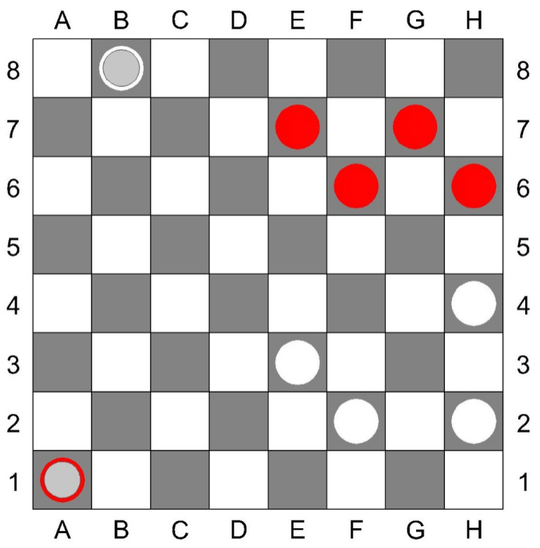

# Шашки

## Состав игры:

1. Игровая доска 64 (8х8) клетки. Клетки двух контрастных цветов, располагающихся
   по диагоналям. Обозначение игровых клеток буквенно-цифровое (как на шахматной
   доске).
2. Шашки двух разных цветов по 12 штук.

## Цель игры:

Выиграть партию - когда у соперника не осталось ни одной шашки, шашки соперника
заблокированы или соперник досрочно признал свое поражение.
При невозможности выигрыша любого из участников игры, партия считается
законченной в ничью.

## Правила:

В игре принимают участие 2 игрока. Игроки располагаются на противоположных
сторонах доски.
Игровое поле (доска) располагается таким образом, чтобы угловое темное поле было
расположено с левой стороны игрока.
Выбор цвета игроками определяется жребием или по договоренности. Шашки
расставляются на трех, ближних к игроку, рядах на темных клетках, как показано на
рисунке.

Право первого хода обычно принадлежит игроку, который играет белым (светлым)
цветом. Ходы осуществляются соперниками поочередно. Ход считается сделанным,
если участник игры после перемещения шашки отпустил руку. Если игрок дотронулся
до шашки, он обязан ей сделать ход. Если, кто-либо из соперников хочет поправить
шашки, обязан предупредить заранее.
В начале игры все шашки соперников являются простыми. Простые шашки можно
перемещать только вперед по диагоналям на соседнюю свободную клетку.
Если простая шашка дошла до последней горизонтали, она становится «дамкой» и
обозначается переворачиванием. Дамка может перемещаться по диагоналям на
любое количество свободных клеток.
Взятие шашки соперника производится, переносом через неё своей, в том случае,
если она находится на соседней с простой шашкой диагональной клетке и за ней
имеется свободное поле. Если после этого хода имеется продолжение для взятия
других шашек соперника, ход продолжается. Шашка (шашки) соперника снимается с
доски. Взятие шашки соперника может производиться, как вперед, так и назад, и
является обязательной, если перед началом игры не договорились об изменении
этого правила.
Взятие дамкой шашек соперника может осуществляться через любое количество
диагональных клеток, при наличии свободного пространства за «жертвой». Если она
снова оказывается на одной диагонали рядом или на расстоянии от шашки соперника,
за которой находится одно или несколько свободных полей, дамка обязательно
должна продолжить взятие последующих и занять любое свободное поле на той же
диагонали за последней взятой шашкой.
В тех случаях, когда простая шашка при взятии достигает последнего горизонтального
ряда и ей предоставляется возможность дальнейшего взятия шашек, то она обязана
тем же ходом продолжать бой, но уже на правах дамки.
В тех случаях, когда шашка достигла последней горизонтали без взятия и ей после
этого предоставляется возможность боя, то она должна бить, при условии, если эта
возможность сохранится лишь следующим ходом на правах дамки.
Битые шашки снимаются с доски только по окончании хода, повторное
«перескакивание» через битые шашки запрещены.