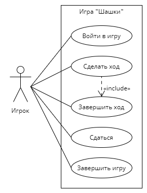

# Лабораторная работа №1

### Диаграмма прецедентов со спецификацией для игры "Шашки"

## Прецедент "Войти в игру"

|                      |                                                                                       |
|----------------------|---------------------------------------------------------------------------------------|
| Описание             | Игроки вводят свои имена, получают шашки, за белых играет первый зарегистрировавшийся |
| Основной исполнитель | Игрок                                                                                 |
| Предусловия          | Игра не начата                                                                        |
| Постусловия          | Игроки вошли в игру, каждому выдано 12 шашек, стороны определены                      |

### Основной сценарий прецедента

| Действия игрока | Отклик системы                   |
|-----------------|----------------------------------|
|                 | 1. Запросить имя игрока          |
| 2. Ввести имя   |                                  |
|                 | 3. Выдать игроку 12 белых шашек  |
|                 | 4. Запросить имя второго игрока  |
| 5. Ввести имя   |                                  |
|                 | 6. Выдать игроку 12 черных шашек |
|                 | 7. Завершить регистрацию игроков |

## Прецедент "Сделать ход"

|                      |                                                                                        |
|----------------------|----------------------------------------------------------------------------------------|
| Описание             | Игроки делают ход                                                                      |
| Основной исполнитель | Игрок                                                                                  |
| Предусловия          | Подошла очередь игрока, нет игроков без шашек, у игроков есть не заблокированные шашки |
| Постусловия          | У игрока нет возможности хода                                                          |

### Основной сценарий прецедента

| Действия игрока  | Отклик системы                    |
|------------------|-----------------------------------|
|                  | 1. Позволить игроку выбрать шашку |
| 2. Выбрать шашку |                                   |
|                  | 3. Обозначить выбранную шашку     |
| 4. Сделать ход   |                                   |
| 5. Завершить ход |                                   |

### Альтернативный сценарий

#### 2а. Игрок выбрал шашку, которая не может ходить

1. ##### Система выводит сообщение "У шашки нет хода"
2. ##### Игрок выбирает другую шашку

#### 2б. У игрока есть шашка, которая может срубить, но он выбрал другую

1. ##### Система выводит сообщение "Есть шашка, которая может срубить"
2. ##### Система подсвечивает шашки, которые могут срубить
3. ##### Игрок выбирает шашку, которая может срубить

#### 5а. Активная шашка игрока может срубить шашку противника

1. ##### Система выводит сообщение "Активная шашка может срубить"
2. ##### Повторить пункт 4

## Прецедент "Сдаться"

|                      |                                                                                        |
|----------------------|----------------------------------------------------------------------------------------|
| Описание             | Игрок решил сдаться                                                                    |
| Основной исполнитель | Игрок                                                                                  |
| Предусловия          | Подошла очередь игрока, нет игроков без шашек, у игроков есть не заблокированные шашки |
| Постусловия          | Игра окончена, победил противоположный игрок                                           |

### Основной сценарий прецедента

| Действия игрока     | Отклик системы                                        |
|---------------------|-------------------------------------------------------|
| 1. Нажать "Сдаться" |                                                       |
|                     | 2. Вывести сообщение подтверждения                    |
| 3. Подтвердить      |                                                       |
|                     | 4. Вывести сообщение о победе противоположного игрока |

### Альтернативный сценарий прецедента

#### 3а. Игрок не подтвердил, что хочет сдаться

* ##### Игра продолжается

## Прецедент "Завершить ход"

|                      |                                                            |
|----------------------|------------------------------------------------------------|
| Описание             | Игрок сделал ход и хочет его закончить                     |
| Основной исполнитель | Игрок                                                      |
| Предусловия          | У игрока нет шашки, которая может срубить шашку противника |
| Постусловия          | Ход перешел другому игроку                                 |

### Основной сценарий прецедента

| Действия игрока           | Отклик системы                              |
|---------------------------|---------------------------------------------|
| 1. Нажать "Завершить ход" |                                             |
|                           | 2. Проверить возможность хода обоих игроков |
|                           | 3. Передать ход противоположному игроку     |

### Альтернативный сценарий прецедента

#### 2а. У обоих игроков нет возможности хода

* ##### Объявляется ничья

## Прецедент "Завершить игру"

|                      |                                                                    |
|----------------------|--------------------------------------------------------------------|
| Описание             | Игрок сделал ход и хочет его закончить                             |
| Основной исполнитель | Игрок                                                              |
| Предусловия          | Игрок сделал ход и у противоположного нет доступных для хода шашек |
| Постусловия          | Объявлен победитель                                                |

### Основной сценарий прецедента

| Действия игрока           | Отклик системы                                |
|---------------------------|-----------------------------------------------|
| 1. Нажать "Завершить ход" |                                               |
|                           | 2. Вывести сообщение о победе текущего игрока |
