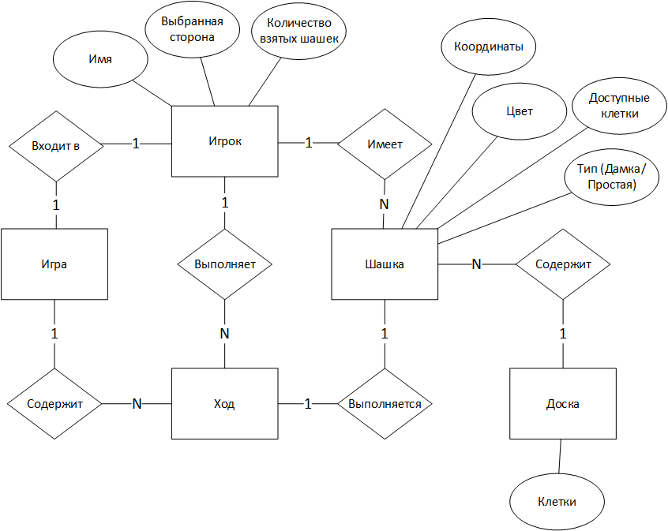

# Лабораторная работа №1

### Модель предметной области для игры "Шашки"

## Запуск игры
Перед началом игры игроки решают, кто будет белым, а кто черным

Тот кто входит в игру первым - получает белые шашки 

При входе в игру каждому игроку выдается **12 шашек** 
соответствующего цвета (первому белые, второму черные)

## Процесс игры

### Игра проходит по такому сценарию:
* игрок выбирает шашку, которой собирается ходить;
* игрок выбирает клетку, в которую хочет сходить;
* проверяется валидность кода;
* выполняется ход;
* если шашка больше не может сделать ход, то переход хода к другому игроку.

Если **шашка** игрока добралась до противоположной (последней) 
горизонтальной линии, то она становится **"дамкой"**

### Игра продолжается до тех пор, пока:
* один из игроков не останется без **доступных** для хода **шашек**;
* один из игроков не **сдастся**;
* не будет объявлена **ничья**.