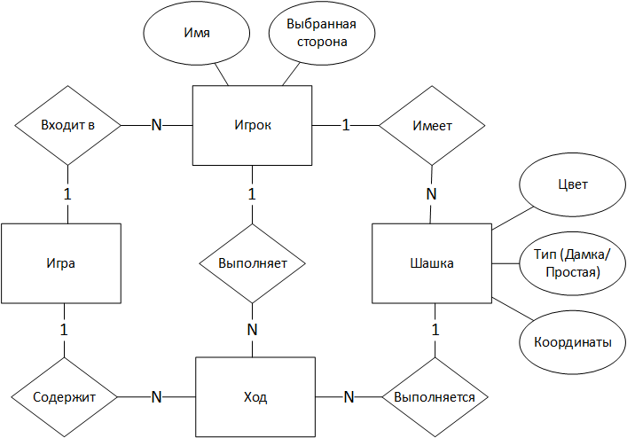

# Лабораторная работа №2

### Модель предметной области для игры "Шашки"

**Игрок** заходит в игру, и заполняет своё **имя**. **Игрок**, который 
первым зашел в игру, автоматически становится игроком белой **стороны**,
второй зашедший - игрок черной **стороны**.

Игроки **имеют** **шашки**, после начала **игры** они получают 12 штук 
соответствующего их стороне **цвета**

При достижении **шашкой** в результате **хода** дальней (последней) 
горизонтальной линии ей присваивается **тип "Дамка"**, до этих пор она 
считается **"Простой"**

**Игра** содержит в себе **ходы**, выполняемые **игроками**, **ход** 
выполняется **шашкой**, в процессе **хода** состояние шашки может меняться:
меняются её **координаты**, а также может измениться ее **тип** 