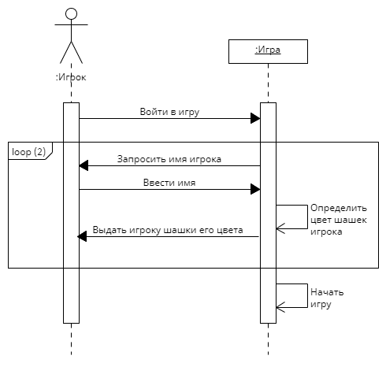
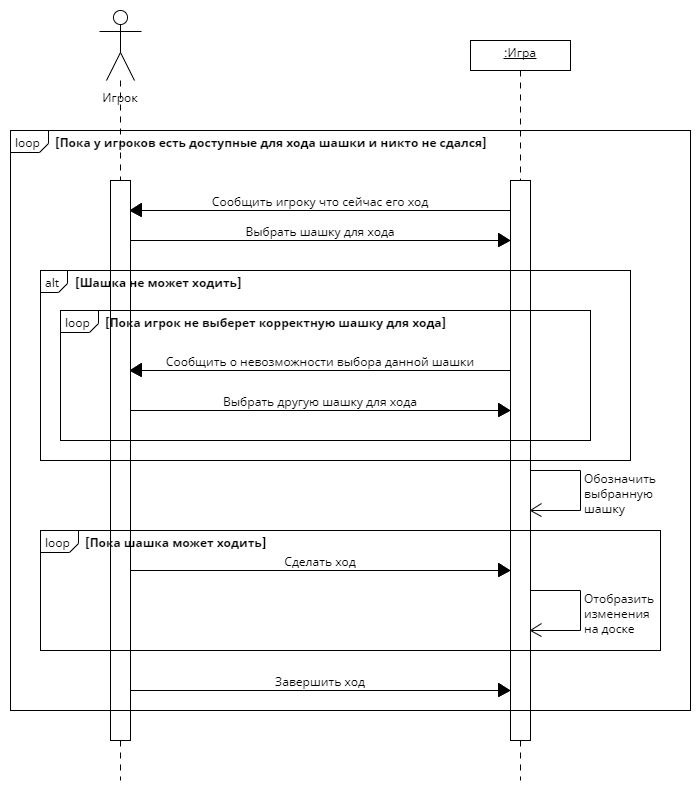
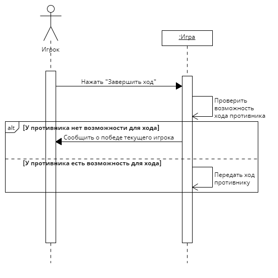
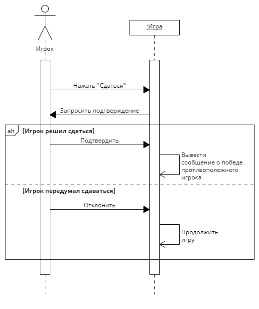
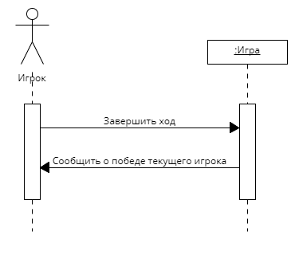

# Лабораторная работа №3

### Создание системных диаграмм последовательностей

## Прецедент "Войти в игру"

|             |                          |
|-------------|--------------------------|
| Действие    | Войти в игру             |
| Ссылки      | Прецедент "Войти в игру" |
| Предусловие | Игра не запущена         |
| Постусловие | Игра запущена            |

|             |                                      |
|-------------|--------------------------------------|
| Действие    | Запросить имя игрока                 |
| Ссылки      | Прецедент "Войти в игру"             |
| Предусловие | Нет обоих имен игроков               |
| Постусловие | Выведено поле для ввода имени игрока |

|             |                                      |
|-------------|--------------------------------------|
| Действие    | Ввести имя                           |
| Ссылки      | Прецедент "Войти в игру"             |
| Предусловие | Выведено поле для вводи имени игрока |
| Постусловие | Игрок ввел свое имя в игру           |

|             |                                |
|-------------|--------------------------------|
| Действие    | Определить цвет шашек игрока   |
| Ссылки      | Прецедент "Войти в игру"       |
| Предусловие | Игрок ввел свое имя в игру     |
| Постусловие | Игрок получил цвет своих шашек |

|             |                                     |
|-------------|-------------------------------------|
| Действие    | Выдать игроку шашки его цвета       |
| Ссылки      | Прецедент "Войти в игру"            |
| Предусловие | Игрок получил цвет своих шашек      |
| Постусловие | Игрок получил 12 шашек своего цвета |

|             |                                                         |
|-------------|---------------------------------------------------------|
| Действие    | Начать игру                                             |
| Ссылки      | Прецедент "Войти в игру"                                |
| Предусловие | Игроки ввели свои имена, получили 12 шашек своего цвета |
| Постусловие | Игра началась                                           |

## Прецедент "Сделать ход"

|             |                                                                             |
|-------------|-----------------------------------------------------------------------------|
| Действие    | Сообщить игроку что сейчас его ход                                          |
| Ссылки      | Прецедент "Сделать ход"                                                     |
| Предусловие | Предыдущий игрок закончил свой ход, у текущего игрока есть возможность хода |
| Постусловие | Текущий игрок оповещен о своем ходе                                         |

|             |                                                                   |
|-------------|-------------------------------------------------------------------|
| Действие    | Выбрать шашку для хода                                            |
| Ссылки      | Прецедент "Сделать ход"                                           |
| Предусловие | Сейчас ход данного игрока, у игрока есть шашки доступные для хода |
| Постусловие | Игрок выбрал шашку для хода                                       |

|             |                                                                |
|-------------|----------------------------------------------------------------|
| Действие    | Сообщить о невозможности выбора данной шашки                   |
| Ссылки      | Прецедент "Сделать ход"                                        |
| Предусловие | Игрок выбрал шашку для хода, шашка не имеет возможности ходить |
| Постусловие | Игрок получил оповещение о невозможности хода данной шашкой    |

|             |                                                             |
|-------------|-------------------------------------------------------------|
| Действие    | Выбрать другую шашку для хода                               |
| Ссылки      | Прецедент "Сделать ход"                                     |
| Предусловие | Игрок получил оповещение о невозможности хода данной шашкой |
| Постусловие | Игрок выбрал другую шашку                                   |

|             |                                                 |
|-------------|-------------------------------------------------|
| Действие    | Обозначить выбранную шашку                      |
| Ссылки      | Прецедент "Сделать ход"                         |
| Предусловие | Игрок выбрал шашку для хода, шашка может ходить |
| Постусловие | Шашка, выбранная игроком, обозначена            |

|             |                                                 |
|-------------|-------------------------------------------------|
| Действие    | Сделать ход                                     |
| Ссылки      | Прецедент "Сделать ход"                         |
| Предусловие | Игрок выбрал шашку для хода, шашка может ходить |
| Постусловие | Игрок сделал ход выбранной шашкой               |

|             |                                     |
|-------------|-------------------------------------|
| Действие    | Отобразить изменения на доске       |
| Ссылки      | Прецедент "Сделать ход"             |
| Предусловие | Игрок сделал ход выбранной шашкой   |
| Постусловие | Положение шашек на доске изменилось |

|             |                                                          |
|-------------|----------------------------------------------------------|
| Действие    | Завершить ход                                            |
| Ссылки      | Прецедент "Сделать ход", прецедент "Завершить ход"       |
| Предусловие | Игрок сделал ход(ы) шашкой, шашка больше не может рубить |
| Постусловие | Игрок завершил свой ход                                  |

## Прецедент "Завершить ход"

|             |                                                          |
|-------------|----------------------------------------------------------|
| Действие    | Нажать "Завершить ход"                                   |
| Ссылки      | Прецедент "Завершить ход"                                |
| Предусловие | Игрок сделал ход(ы) шашкой, шашка больше не может рубить |
| Постусловие | Игрок завершил свой ход                                  |

|             |                                                                             |
|-------------|-----------------------------------------------------------------------------|
| Действие    | Проверить возможность хода противника                                       |
| Ссылки      | Прецедент "Завершить ход"                                                   |
| Предусловие | Игрок завершил свой ход                                                     |
| Постусловие | Известен результат проверки возможности хода игрока, к которому перешел ход |

|             |                                                                     |
|-------------|---------------------------------------------------------------------|
| Действие    | Сообщить о победе текущего игрока                                   |
| Ссылки      | Прецедент "Завершить ход"                                           |
| Предусловие | Игрок завершил свой ход, у противника нет шашек, доступных для хода |
| Постусловие | Объявлен победитель игры                                            |

|             |                                                                      |
|-------------|----------------------------------------------------------------------|
| Действие    | Передать ход противнику                                              |
| Ссылки      | Прецедент "Завершить ход"                                            |
| Предусловие | Игрок завершил свой ход, у противника есть шашки, доступные для хода |
| Постусловие | Ход переходит следующему игроку                                      |

## Прецедент "Сдаться"

|             |                                                 |
|-------------|-------------------------------------------------|
| Действие    | Нажать "Сдаться"                                |
| Ссылки      | Прецедент "Сдаться"                             |
| Предусловие | Игра продолжается, игрок принял решение сдаться |
| Постусловие | Запросить у игрока подтверждение                |

|             |                                   |
|-------------|-----------------------------------|
| Действие    | Запросить подтверждение           |
| Ссылки      | Прецедент "Сдаться"               |
| Предусловие | Игрок нажал "Сдаться"             |
| Постусловие | Вывести игроку окно подтверждения |

|             |                                                                   |
|-------------|-------------------------------------------------------------------|
| Действие    | Подтвердить                                                       |
| Ссылки      | Прецедент "Сдаться"                                               |
| Предусловие | Выведено окно подтверждения сдачи, игрок уверен в желании сдаться |
| Постусловие | Игрок подтвердил желание сдаться                                  |

|             |                                                    |
|-------------|----------------------------------------------------|
| Действие    | Вывести сообщение о победе противоположного игрока |
| Ссылки      | Прецедент "Сдаться"                                |
| Предусловие | Игрок подтвердил желание сдаться                   |
| Постусловие | Объявлен победитель текущей игры                   |

|             |                                                             |
|-------------|-------------------------------------------------------------|
| Действие    | Отклонить                                                   |
| Ссылки      | Прецедент "Сдаться"                                         |
| Предусловие | Выведено окно подтверждения сдачи, игрок не хочет сдаваться |
| Постусловие | Игрок отклонил сдачу                                        |

|             |                      |
|-------------|----------------------|
| Действие    | Продолжить игру      |
| Ссылки      | Прецедент "Сдаться"  |
| Предусловие | Игрок отклонил сдачу |
| Постусловие | Игра продолжается    |

## Прецедент "Завершить игру"

|             |                                                                    |
|-------------|--------------------------------------------------------------------|
| Действие    | Завершить ход                                                      |
| Ссылки      | Прецедент "Завершить игру", прецедент "Завершить ход"              |
| Предусловие | Игрок сделал ход и у противоположного нет доступных для хода шашек |
| Постусловие | Ход игрока окончен, противоположный игрок проиграл                 |

|             |                                                         |
|-------------|---------------------------------------------------------|
| Действие    | Сообщить о победе текущего игрока                       |
| Ссылки      | Прецедент "Завершить игру"                              |
| Предусловие | Игрок завершил свой ход, противоположный игрок проиграл |
| Постусловие | Объявлен победитель игры                                |
