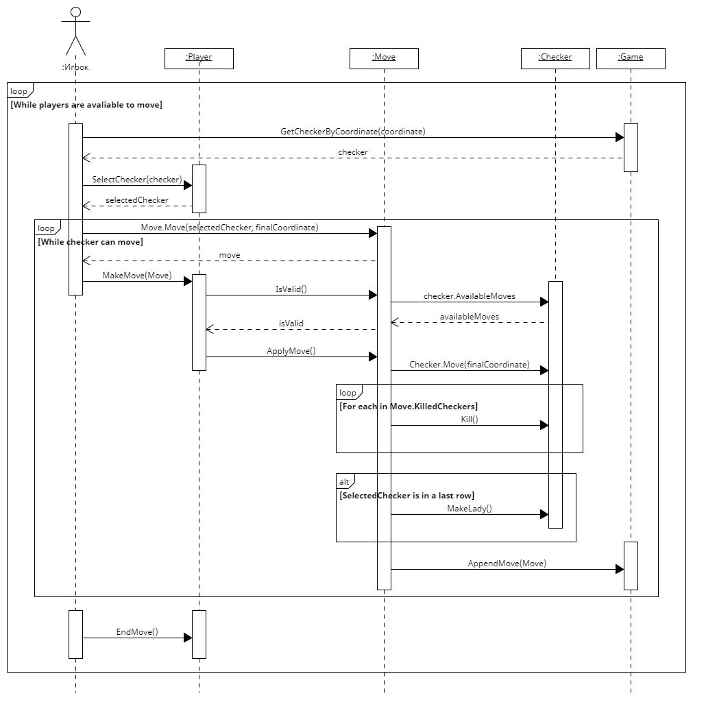

# Лабораторная работа №4

### Создание диаграмм взаимодействия

## Прецедент "Войти в игру"

|             | Game()                   |
|-------------|--------------------------|
| Ссылки      | Прецедент "Войти в игру" |
| Предусловие | Игра не запущена         |
| Постусловие | Игрок запустил игру      |

|             | GenerateBoard()                |
|-------------|--------------------------------|
| Ссылки      | Прецедент "Войти в игру"       |
| Предусловие | Игра запущена                  |
| Постусловие | Игра сформировала игровое поле |

|             | CreatePlayer()                                 |
|-------------|------------------------------------------------|
| Ссылки      | Прецедент "Войти в игру"                       |
| Предусловие | Игра запущена                                  |
| Постусловие | Игрок ввел свое имя, определена сторона игрока |

|             | Player()                                       |
|-------------|------------------------------------------------|
| Ссылки      | Прецедент "Войти в игру"                       |
| Предусловие | Игрок ввел свое имя, определена сторона игрока |
| Постусловие | Создан экземпляр класса "Игрок"                |

|             | AppendPlayer()                       |
|-------------|--------------------------------------|
| Ссылки      | Прецедент "Войти в игру"             |
| Предусловие | Создан экземпляр класса "Игрок"      |
| Постусловие | Игрок добавлен в массив игроков игры |

|             | Checker()                                                    |
|-------------|--------------------------------------------------------------|
| Ссылки      | Прецедент "Войти в игру"                                     |
| Предусловие | Создан экземпляр класса "Игрок"                              |
| Постусловие | Создан экземпляр класса "Шашка" с соответствующим владельцем |

|             | AppendChecker()                     |
|-------------|-------------------------------------|
| Ссылки      | Прецедент "Войти в игру"            |
| Предусловие | Создан экземпляр класса "Шашка"     |
| Постусловие | Шашка добавлена в массив шашек игры |

|             | CurrentPlayer = Game.Players[0]         |
|-------------|-----------------------------------------|
| Ссылки      | Прецедент "Войти в игру"                |
| Предусловие | Созданы экземпляры класса обоих игроков |
| Постусловие | Начался ход первого игрока              |

## Прецедент "Сделать ход"

|             | GetCheckerByCoordinate()                                 |
|-------------|----------------------------------------------------------|
| Ссылки      | Прецедент "Сделать ход"                                  |
| Предусловие | Сейчас ход игрока, игрок имеет шашки, доступные для хода |
| Постусловие | Получены координаты выбранной шашки                      |

|             | SelectChecker()                     |
|-------------|-------------------------------------|
| Ссылки      | Прецедент "Сделать ход"             |
| Предусловие | Получены координаты выбранной шашки |
| Постусловие | Шашка выбрана по координатам        |

|             | Move.Move()                                                                |
|-------------|----------------------------------------------------------------------------|
| Ссылки      | Прецедент "Сделать ход"                                                    |
| Предусловие | Выбрана шашка                                                              |
| Постусловие | Создан экземпляр класса "Ход" для выбранной шашки с желаемыми координатами |

|             | MakeMove()                                  |
|-------------|---------------------------------------------|
| Ссылки      | Прецедент "Сделать ход"                     |
| Предусловие | Создан экземпляр класса "Ход"               |
| Постусловие | Игрок подтвердил желание сделать данный ход |

|             | IsValid()                                   |
|-------------|---------------------------------------------|
| Ссылки      | Прецедент "Сделать ход"                     |
| Предусловие | Игрок подтвердил желание сделать данный ход |
| Постусловие | Известно, является ли данный ход валидным   |

|             | checker.AvailableMoves                   |
|-------------|------------------------------------------|
| Ссылки      | Прецедент "Сделать ход"                  |
| Предусловие | Запущена проверка на валидность          |
| Постусловие | Получены доступные ходы для данной шашки |

|             | ApplyMove()                         |
|-------------|-------------------------------------|
| Ссылки      | Прецедент "Сделать ход"             |
| Предусловие | Ход сформирован и является валидным |
| Постусловие | Ход выполнен                        |

|             | Checker.Move()                                           |
|-------------|----------------------------------------------------------|
| Ссылки      | Прецедент "Сделать ход"                                  |
| Предусловие | Ход сформирован, является валидным начал свое выполнение |
| Постусловие | Шашка передвинута на необходимую финальную координату    |

|             | Kill()                                                      |
|-------------|-------------------------------------------------------------|
| Ссылки      | Прецедент "Сделать ход"                                     |
| Предусловие | Шашка в свой ход побила шашки противника                    |
| Постусловие | Побитые шашки противника считаются побитыми и уходят с поля |

|             | MakeLady()                                         |
|-------------|----------------------------------------------------|
| Ссылки      | Прецедент "Сделать ход"                            |
| Предусловие | Шашка достигла последней горизонтальной координаты |
| Постусловие | Шашка стала "Дамкой"                               |

|             | AppendMove()                                |
|-------------|---------------------------------------------|
| Ссылки      | Прецедент "Сделать ход"                     |
| Предусловие | Ход выполнен                                |
| Постусловие | Ход добавлен в историю игры (историю ходов) |

|             | EndMove()                                                           |
|-------------|---------------------------------------------------------------------|
| Ссылки      | Прецедент "Сделать ход", прецедент "Завершить ход"                  |
| Предусловие | Игрок произвел ход(ы) и больше не может сделать ход активной шашкой |
| Постусловие | Игрок закончил делать ходы                                          |

## Прецедент "Завершить ход"

|             | OppositePlayer()                           |
|-------------|--------------------------------------------|
| Ссылки      | Прецедент "Завершить ход"                  |
| Предусловие | Известен текущий игрок                     |
| Постусловие | Получен противоположный (не текущий) игрок |

|             | IsAvailableToMove()                         |
|-------------|---------------------------------------------|
| Ссылки      | Прецедент "Завершить ход"                   |
| Предусловие | Экземпляр игрока создан                     |
| Постусловие | Известно, может ли игрок сейчас сделать ход |

|             | PrintDraw()                                                     |
|-------------|-----------------------------------------------------------------|
| Ссылки      | Прецедент "Завершить ход"                                       |
| Предусловие | Игра продолжается, у обоих игроков нет доступных для хода шашек |
| Постусловие | Игра закончилась ничьей                                         |

|             | Game.CurrentPlayer = oppositePlayer                            |
|-------------|----------------------------------------------------------------|
| Ссылки      | Прецедент "Завершить ход"                                      |
| Предусловие | Текущий и противоположный игрок имеют доступные для хода шашки |
| Постусловие | Противоположный игрок объявлен текущим                         |

|             | PrintWinner()                                           |
|-------------|---------------------------------------------------------|
| Ссылки      | Прецедент "Завершить ход"                               |
| Предусловие | Противоположный игрок не имеет доступные для хода шашки |
| Постусловие | Объявлен победитель (текущий игрок)                     |

|             | Winner                          |
|-------------|---------------------------------|
| Ссылки      | Прецедент "Завершить ход"       |
| Предусловие | Объявлен победитель             |
| Постусловие | Игрок(и) узнали, кто победитель |

## Прецедент "Сдаться"

|             | GiveUp()                                |
|-------------|-----------------------------------------|
| Ссылки      | Прецедент "Сдаться"                     |
| Предусловие | Игра продолжается, игрок желает сдаться |
| Постусловие | Игрок сдался                            |

|             | PrintWinner()                               |
|-------------|---------------------------------------------|
| Ссылки      | Прецедент "Сдаться"                         |
| Предусловие | Игрок сдался                                |
| Постусловие | Объявлен победитель (противоположный игрок) |

## Прецедент "Завершить игру"

|             | PrintWinner()                                           |
|-------------|---------------------------------------------------------|
| Ссылки      | Прецедент "Завершить ход"                               |
| Предусловие | Противоположный игрок не имеет доступные для хода шашки |
| Постусловие | Объявлен победитель (текущий игрок)                     |
