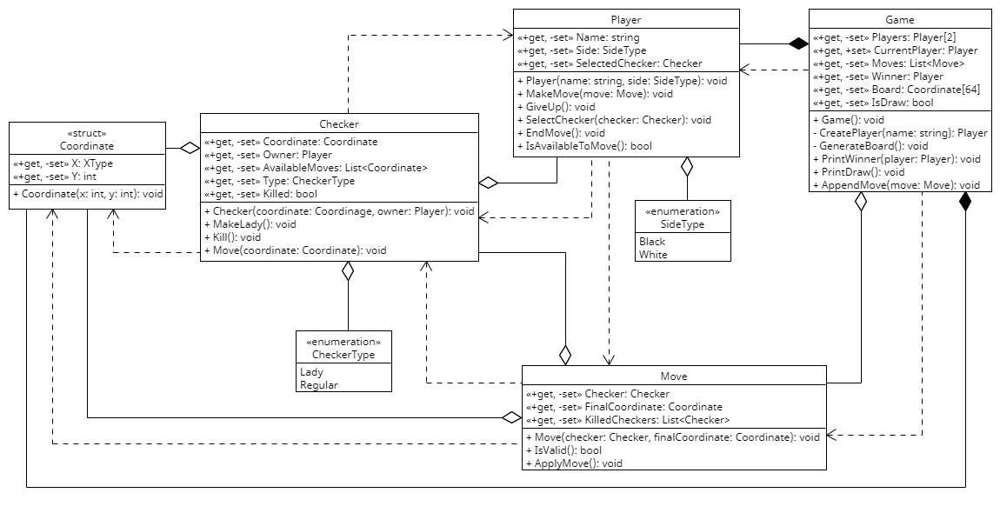

# Лабораторная работа №5

### Создание диаграмм классов проектирования

## Диаграмма классов для игры "Шашки"

### Структура "Coordinate" (Координата)

#### Данная структура представляет собой координату клетки на игровом поле

##### Свойства:

| Название | Описание                                                              |
|----------|-----------------------------------------------------------------------|
| X        | Данное свойство хранит горизонтальную координату клетки игрового поля |
| Y        | Данное свойство хранит вертикальную координату клетки игрового поля   |

##### Методы:

| Название   | Описание                                                                                                               |
|------------|------------------------------------------------------------------------------------------------------------------------|
| Coordinate | Данный метод - конструктор структуры, инициализирующий её экземпляр в начале игры, принимающий в себя координаты X и Y |

### Перечень (enum) "CheckerType" (Тип шашки)

#### Данный перечень содержит в себе возможные типы шашки, а именно: Lady (Дамка) и Regular (Обычная)

### Класс "Checker" (Шашка)

#### Данный класс представляет собой игровую единицу (шашку)

##### Свойства:

| Название       | Описание                                                                                                                                                                                      |
|----------------|-----------------------------------------------------------------------------------------------------------------------------------------------------------------------------------------------|
| Coordinate     | Данное свойство хранит текущую координату шашки                                                                                                                                               |
| Owner          | Данное свойство хранит игрока, являющегося владельцем данной шашки                                                                                                                            |
| AvailableMoves | Данное свойство хранит координаты, доступные для хода, при этом при обращении к данному полю сначала происходит анализ и запись доступных координат, после чего возвращается массив доступных |
| Type           | Данное свойство хранит тип шашки (Дамка/Обычная)                                                                                                                                              |
| Killed         | Данное свойство указывает на состояние шашки (В игре или срублена)                                                                                                                            |

##### Методы:

| Название | Описание                                                                                                                                 |
|----------|------------------------------------------------------------------------------------------------------------------------------------------|
| Checker  | Данный метод - конструктор класса "Шашка", инициализирующий его экземпляр в начале игры, принимающий в себя координаты шашки и владельца |
| MakeLady | Данный метод необходим для назначения шашке типа "Дамка" при достижении последней горизонтальной линии                                   |
| Kill     | Данный метод изменять состояние шашки на "Срублена"                                                                                      |
| Move     | Данный метод позволяет изменить координаты шашки                                                                                         |

### Перечень (enum) "SideType" (Сторона)

#### Данный перечень содержит в себе возможные стороны игроков, а именно: Black (Черный) и White (Белый)

### Класс "Player" (Игрок)

#### Данный класс представляет собой игрока в шашки

##### Свойства:

| Название        | Описание                                                                                          |
|-----------------|---------------------------------------------------------------------------------------------------|
| Name            | Данное свойство хранит имя игрока                                                                 |
| Side            | Данное свойство хранит сторону игрока                                                             |
| SelectedChecker | Данное свойство хранит выбранную игроком в текущем ходе шашку (ту, которой он собирается сходить) |

##### Методы:

| Название          | Описание                                                                                                                         |
|-------------------|----------------------------------------------------------------------------------------------------------------------------------|
| Player            | Данный метод - конструктор класса "Игрок", инициализирующий его экземпляр в начале игры, принимающий в себя имя игрока и сторону |
| MakeMove          | Данный метод позволяет игроку сделать заданный им ход, принимая на в себя экземпляр класса "Ход"                                 |
| GiveUp            | Данный метод позволяет игроку сдаться, в случае подтверждения игра заканчивается его поражением                                  |
| SelectChecker     | Данный метод позволяет игроку выбрать свою шашку на поле, принимает в себя экземпляр шашки                                       |
| EndMove           | Данный метод позволяет игроку закончить ход, если он желает и если если он не может продолжить ход                               |
| IsAvailableToMove | Данный метод позволяет узнать о возможности совершения хода игроком                                                              |

### Класс "Move" (Ход)

#### Данный класс представляет собой ход шашки на поле

##### Свойства:

| Название        | Описание                                                                       |
|-----------------|--------------------------------------------------------------------------------|
| Checker         | Данное свойство хранит шашку, которая совершает данный ход                     |
| FinalCoordinate | Данное свойство хранит конечную координату шашки после совершения данного хода |
| KilledCheckers  | Данное свойство хранит список шашек, срубленных данным ходом                   |

##### Методы:

| Название          | Описание                                                                                                                          |
|-------------------|-----------------------------------------------------------------------------------------------------------------------------------|
| Move              | Данный метод - конструктор класса "Ход", инициализирующий его экземпляр, принимающий в себя имя шашку и конечную координату хода  |
| IsValid           | Данный метод позволяет определить валидность данного хода (может ли шашка, согласно правилам игры, попасть в заданную координату) |
| ApplyMove         | Данный метод позволяет выполнить ход, и переместить шашку в указанную конечную координату, в случае, если ход валидный            |

### Класс "Game" (Игра)

#### Данный класс представляет собой игру в шашки

##### Свойства:

| Название      | Описание                                                                                         |
|---------------|--------------------------------------------------------------------------------------------------|
| Players       | Данное свойство хранит двух игроков текущей партии                                               |
| CurrentPlayer | Данное свойство хранит текущего (ходящего) игрока                                                |
| Moves         | Данное свойство хранит в себе все ходы текущей партии                                            |
| Winner        | Данное свойство хранит в себе игрока, который выиграл в данной партии                            |
| Board         | Данное свойство хранит в себе поле/доску, состоящую из координат (экземпляров класса Coordinate) |
| IsDraw        | Данное свойство хранит в себе закончилась ли игра "Ничьей"                                       |

##### Методы:

| Название      | Описание                                                                                                                            |
|---------------|-------------------------------------------------------------------------------------------------------------------------------------|
| Game          | Данный метод - конструктор класса "Игра", начинающий игру                                                                           |
| CreatePlayer  | Данный метод позволяет создать экземпляр класса "Игрок", приняв в себя имя игрока, и назначив игроку необходимые атрибуты (сторону) |
| GenerateBoard | Данный метод инициализирует поле/доску, создает необходимые экземпляры класса "Координата" и сохраняет в игре                       |
| PrintWinner   | Данный метод позволяет отобразить игрока-победителя, а также сохраняет его в свойстве                                               |
| PrintDraw     | Данный метод позволяет отобразить, что игра закончилась "Ничьей", а также сохраняет это в свойство                                  |
| AppendMove    | Данный метод позволяет добавить в игру выполненный ход                                                                              |